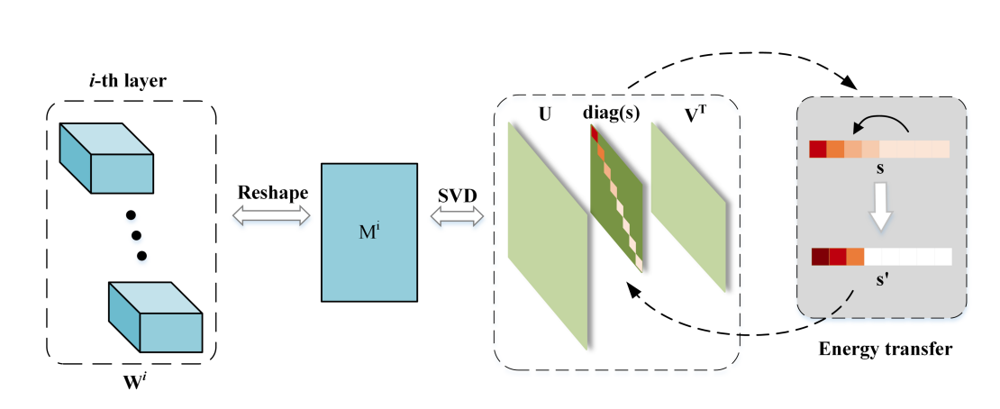

## 基于奇异值的感知器压缩

### 介绍
华南理工大学机器智能与数据科学课程设计代码仓库

### 摘要
Transformer在计算机视觉领域的各个任务表现出了优异的性能，逐渐成为了计算机视觉领域的主流骨干网络，然而其高昂的计算成本与存储成本阻碍了其在资源受限设备的应用部署。我们注意到，在视觉Transformer模型由感知器组成，其参数空间仅需要一个子集便足以对图片的表征信息进行有效提取。基于此，我们设计了一个基于奇异值分解的视觉Transformer压缩方案，在训练中将模型参数进行奇异值裁剪以将其投影到低秩空间，最终在训练完成利用奇异值分解将模型中的感知器进行分解。我们将我们的模型应用于CIFAR10数据集和CIFAR100数据集进行实验验证，在只对模型精度造成轻微影响的前提下有效降低了模型的参数计算量。

### 方法介绍

<div align="center">
  
</div>

### 训练
```bash
python lrpet.py --model vit --prun_goal 0.50 
```
